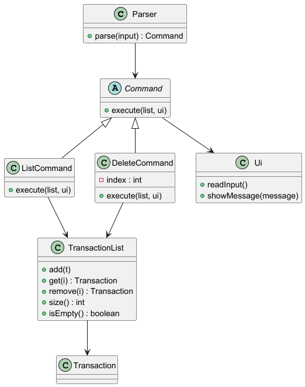
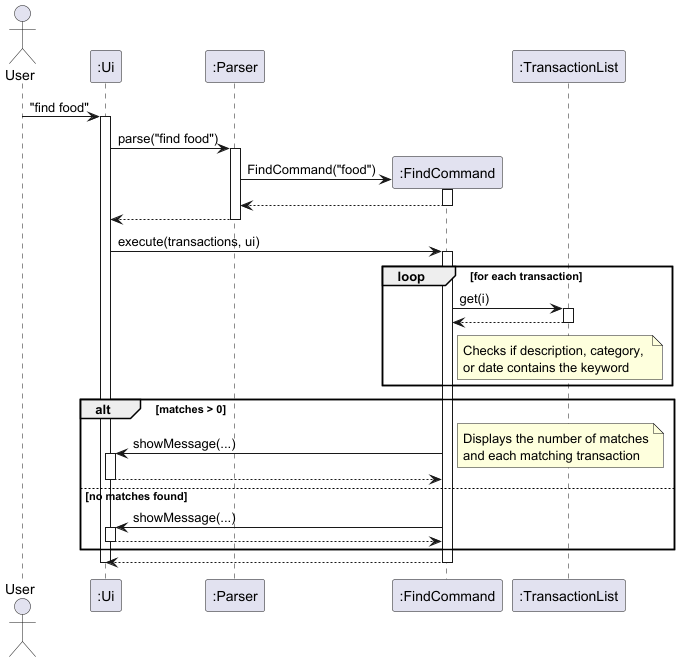
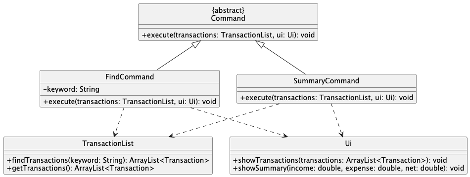
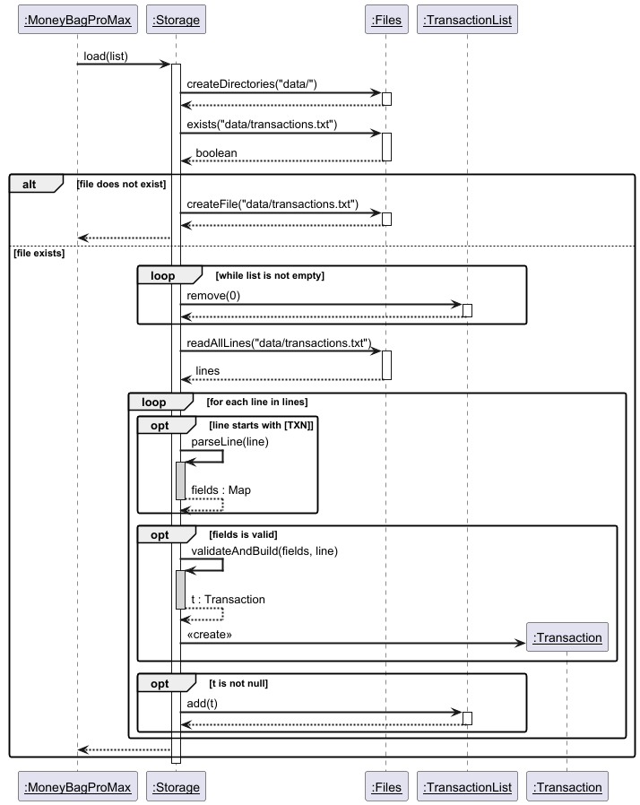
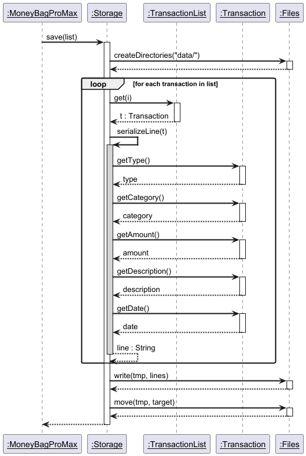

# Developer Guide

## Acknowledgements

{list here sources of all reused/adapted ideas, code, documentation, and third-party libraries -- include links to the original source as well}

## Design & implementation

# Design

## Architecture

(Overall system architecture diagram and explanation)

## Components
### Parser
### Command
### Ui
### TransactionList / Storage
# Implementation

## List and Delete Transaction Feature

### Overview
The list and delete transaction features allow users to manage their transactions stored in the application.
The `list` command displays all recorded transactions in a numbered format, while the `delete` command removes a transaction based on its index.
These features improve usability by allowing users to review and remove transactions easily.

### Architecture and Flow
When a user enters a command, the input is first handled by the `Ui` component, which reads the input and passes it to the `Parser`.
The `Parser` then interprets the input and creates the appropriate `Command` object (`ListCommand` or `DeleteCommand`).
The command is executed using the `TransactionList` to retrieve or remove transactions, and the result is displayed to the user through the `Ui`.

### Sequence Diagram for List Command


### Listing Transactions
The `list` command is implemented using the `ListCommand` class.
When executed, the command checks whether the transaction list is empty using the `isEmpty()` method.
If the list is not empty, it iterates through the transactions using the `size()` and `get(int i)` methods and displays them in a numbered format.

### Sequence Diagram for Delete Command


### Deleting Transactions
The `delete` command is implemented using the `DeleteCommand` class.
The `Parser` extracts the index provided by the user and passes it to the `DeleteCommand`.
The `DeleteCommand` then removes the corresponding transaction from `TransactionList` using the `remove(int i)` method and displays a confirmation message.

### Class Diagram


### Design Considerations
This feature uses a command-based architecture to ensure separation of concerns.
The `Parser` is responsible only for parsing user input, while each command class is responsible for executing its own logic.
The `TransactionList` class manages the storage of transactions, which improves modularity and maintainability.
Assertions and logging are used in `TransactionList` as part of defensive programming to detect invalid operations and to record important actions such as adding or removing transactions.

### Alternatives Considered
One alternative was to place all command logic inside the `Parser` class using conditional statements.
However, this approach would make the `Parser` class too large and difficult to maintain as more commands are added.
Another alternative was to allow the `Ui` class to directly modify the transaction list, but this would reduce modularity and violate separation of concerns.
The chosen design using separate command classes was preferred because it improves extensibility and maintainability.

### Future Improvements
Possible future improvements include allowing deletion of multiple transactions at once, supporting filtered list views, and adding an undo feature to restore deleted transactions

---

## Find and Summary Transaction Features

### Overview
The `find` and `summary` features allow users to draw meaningful insights from their recorded transactions.
The `find` command locates specific transactions based on keyword matching, allowing users to search for distinct transactions or categories. 
The `summary` command calculates and displays the overall statistics (eg. total expense) for the user to see at a glance.

### Architecture and Flow
Similar to the broader application architecture, these features rely on the interaction between the `Parser`, `Command`, `TransactionList`, and `Ui` components.
1. The `Parser` receives raw input (e.g., `find food` or `summary`) and instantiates either a `FindCommand` containing the target keyword, or a `SummaryCommand`.
2. Upon calling `execute()`, the respective command interacts with the `TransactionList` to either filter for matches or aggregate financial data.
3. The computed results are formatted and printed to the user via the `Ui`.

### Finding Transactions
The `find` command is encapsulated within the `FindCommand` class. 
During execution, the method iterates through the current list, comparing the target keyword against the description of each transaction.

#### Sequence Diagram for Find Command
The following sequence diagram illustrates the precise object interactions when a user searches for a keyword.


### Summarizing Transactions
The `summary` command is handled by the `SummaryCommand` class. 
It performs computations over the list of transactions. 
It iterates through the entire `TransactionList`, categorising each entry as either an Income or an Expense, and sums the respective totals before calculating the net balance.

#### Sequence Diagram for Summary Command
The following sequence diagram illustrates the interactions when a user wants to see a summary of their transactions.


### Class Diagram
Both commands adhere to the application's Command pattern structure. The diagram below shows how `FindCommand` and `SummaryCommand` inherit from the abstract `Command` class and depend on `TransactionList` and `Ui`.



### Design Considerations
* **Case-Insensitive Searching:** For the `find` feature, it was decided that keyword matching should be case-insensitive (e.g., searching "food" returns "Food" and "FOOD"). This greatly enhances user experience, as users do not need to remember the exact capitalization of their previous entries.
* **Stream-Based Indexing:** A major design consideration was how to display matching transactions alongside their original indices from the main list. Instead of iterating through the list and keeping a separate counter, IntStream.range(0, list.size()) was used.

### Alternatives Considered
* **Alternative for Summary:** We considered caching the total income and expense values inside `TransactionList`, updating them dynamically every time an item is added or deleted. While this makes the `summary` command run in O(1) time, it heavily complicates the `add` and `delete` operations and introduces state-synchronization bugs. The O(N) calculation upon execution was chosen for stability and simplicity.

### Future Improvements
* **Time-Bound Summaries:** Upgrading the `summary` command to accept date parameters, allowing users to see summaries for specific months or weeks (e.g., `summary /from 2026-01-01 /to 2026-01-31`).

---

## Income Class

### Overview
The `Income` class represents an income transaction in the application.
It extends the abstract `Transaction` class, alongside `Expense`, sharing common fields: `category`, `amount`, `description`, and `date`.

### Design
`Income` enforces a fixed set of valid categories defined as a static list:

| Category | Description |
|---|---|
| `salary` | Regular employment income |
| `freelance` | Contract or freelance work |
| `investment` | Returns from investments |
| `business` | Business revenue |
| `gift` | Monetary gifts received |
| `misc` | Any other income |

Category validity is enforced via an assertion in the constructor, consistent with the defensive programming approach used elsewhere in the codebase.
Logging is configured at `WARNING` level to reduce noise during normal operation.

### Key Methods
- `getType()` — returns `"income"`, used to distinguish transaction types polymorphically at runtime.
- `toString()` — formats the transaction for display (e.g. `[Income] salary "June paycheck" $3000.00 (2026-06-01)`).

### Design Considerations
The `Income` and `Expense` classes are intentionally kept symmetric in structure.
Both extend `Transaction` and override `getType()` and `toString()`, making it straightforward to introduce new transaction types in future by simply extending `Transaction` and implementing these methods.
Keeping the valid category list as a `static final` field on the class (rather than in the `Parser` or elsewhere) ensures validation logic stays close to the data it governs.

### Alternatives Considered
One alternative was to represent transaction types using an enum field on a single `Transaction` class rather than separate subclasses.
However, using subclasses allows each type to define its own valid categories and formatting logic independently, which is more extensible as the application grows.

### Future Improvements
- Allow user-defined custom categories beyond the fixed list.
- Add support for recurring income entries (e.g. monthly salary auto-logged).

---

## Persistent Storage Feature

### Overview
The persistent storage feature allows transactions to be saved across sessions so that user data is not lost when the application exits.
The `Storage` class is responsible for reading from and writing to a flat file (`data/transactions.txt`) on disk.
It is invoked on startup to reload saved transactions, and after every mutating command to persist the latest state.

### Architecture and Flow
The `Storage` class operates independently of the command pipeline and is called directly by the main application loop.
On startup, `Storage.load()` reads the data file line by line, parses each transaction record, and populates the `TransactionList`.
After any command that modifies the list (add, delete, etc.), `Storage.save()` serializes the entire `TransactionList` back to disk atomically using a temporary file, replacing the previous file only once the write succeeds.

### Sequence Diagram for Load


### Loading Transactions
On startup, `load()` ensures the `data/` directory and `transactions.txt` file exist, creating them if necessary.
It then reads all lines from the file, skipping any that do not begin with the `[TXN]` prefix.
Each valid line is parsed by `parseLine()` into a key-value map of fields (`type`, `category`, `amount`, `description`, `date`).
The appropriate `Transaction` subclass — either `Income` or `Expense` — is instantiated and added to the `TransactionList`.
Malformed lines are skipped with a warning rather than halting the application, so a single corrupt entry does not prevent the rest of the data from loading.

### Sequence Diagram for Save


### Saving Transactions
`save()` serializes every transaction in the list into a pipe-delimited string via `serializeLine()`, producing lines of the form:
```
[TXN] | type=income | category=food | amount=12.5 | description=lunch | date=2026-03-25
```
The lines are first written to a temporary file (`transactions.txt.tmp`), which is then atomically moved to replace `transactions.txt`.
This two-step write ensures that a crash or interruption during saving cannot corrupt the existing data file.

### Class Diagram


### Design Considerations
The `Storage` class is decoupled from the command classes and interacts only with `TransactionList`, keeping concerns cleanly separated.
Atomic saves via a temporary file were chosen to protect data integrity — a partial write leaves the previous file intact.
The pipe-delimited `[TXN] | key=value` format is human-readable and easy to extend with new fields without breaking backward compatibility, since fields are parsed by name rather than by position.
Assertions are used throughout to enforce preconditions such as non-null inputs and positive amounts, consistent with the defensive programming approach used elsewhere in the codebase.

### Alternatives Considered
One alternative was to use Java's `ObjectOutputStream` for binary serialization, which would require less parsing code.
However, this produces opaque binary files that are difficult to inspect or repair manually, and are brittle across refactors that rename classes.
Another alternative was a database such as SQLite, but this would introduce an external dependency disproportionate to the application's scope.
The plain-text flat-file approach was chosen for its simplicity, transparency, and zero external dependencies.

### Future Improvements
Possible future improvements include supporting multiple save files or profiles, compressing the data file for large transaction histories, and adding a backup rotation strategy to retain recent snapshots in case of data corruption.

---

## Product scope
### Target user profile

{Describe the target user profile}

### Value proposition

{Describe the value proposition: what problem does it solve?}

## User Stories

|Version| As a ... | I want to ... | So that I can ...|
|--------|----------|---------------|------------------|
|v1.0|new user|see usage instructions|refer to them when I forget how to use the application|
|v2.0|user|find a to-do item by name|locate a to-do without having to go through the entire list|

## Non-Functional Requirements

{Give non-functional requirements}

## Glossary

* *glossary item* - Definition

## Instructions for manual testing

{Give instructions on how to do a manual product testing e.g., how to load sample data to be used for testing}
